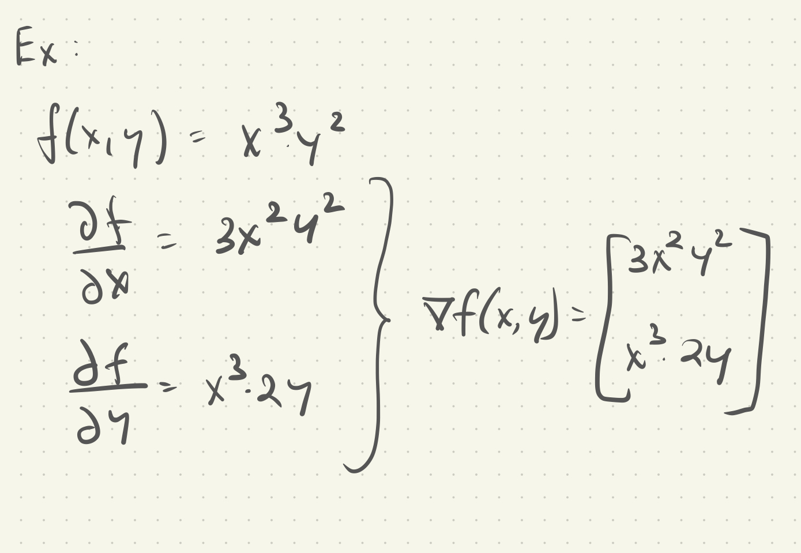

# Calculus

## Derivatives

- Function of a real variable (x,y,z,...) that measures the sesnitivity to change of the function value/output WRT the argument/input.
- The derivative of a function `f(x)` is the slope of the tangent of the function `f(x)` at a given `x`

## Gradient

> A gradient is the direction of the steepest ascent

- Gradients take the partial derivative of a function WRT each dimension. 

## Back-propagation algorithm

> Essential for learning + training large neural networks. 

- A simple neural network has one input and one output node and hidden layers of multiple nodes. The nodes are connected with weights <em> wij </em>, these weights are the network parameters. 

### Activation function

Each node has a input `x`, an activation function `f(x)` and an output `y = f(x)`. `f(x)` has to be non-linear for the neural network to learn non-linear models. 

An example of an activation function: $\frac{1}{1 + e^-x}$